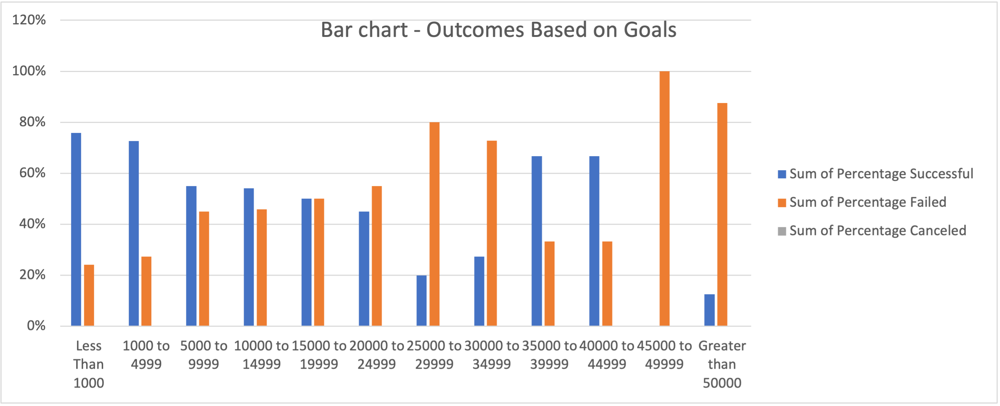
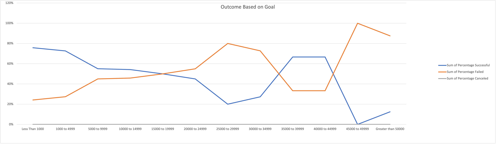
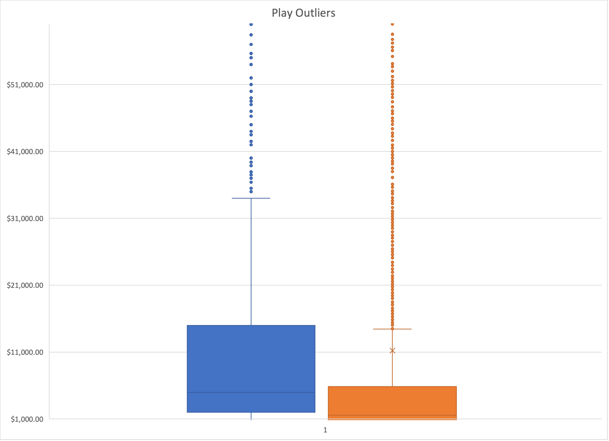

# Analysis of Kickstarter Campaign

## Overview of the Project 
Analyzing the Louise's Kickstarter campaign file to determine which category was the most successful. 

### Step 1. Profile the data
 Reviewed the Louise's "Kickstarter" Campaign file by formating, filtering, identifying the different data fields and numbers of records present in the data file.

After modifying the Kickstarter data file by adding fields like Percentage funded,Average donations,Parent category,sub category,Date created conversion,Date ended conversion,Years within the file, analyzed that Theater/Play category was successful than others catergories.

### Step 2. Trying to analyze the data of Theater/play category based on Launch dates and funding goals

### Analysis of Outcomes Based on Launch Date
  
To determine the campaign status for Theater catergory in relation to their Launch dates and Outcomes

Modified the file by adding "Year" filed by calculate the year from the "Date created conversion" column.
Pivot table and Pivot Chart for the Theater category was created to view the staus of the outcomes against months of the years.
-Worksheet added to the Kickstarter file  -  "Theater Outcomes by Launch Date"

Pivot table and Pivot chart to view the Theater category analysis based on Outcomes (Success,Failed,Canceled) against months of the year.

### Analysis of Outcomes Based on Goals

To determine the Campaign status for Play Subcategory in relation to their Goal and Outcomes

New sheet added by extracting data of Goals and Outcomes filed from the Kickstarter file to analyze deeper into the Goals based on the outcomes.
-Worksheet added to the Kickstarter file  - "Outcome Based on Goals"

Pivot table and Pivot line chart to view the Plays analysis based on Outcomes for the Goal ranges. 

### Challenges and Difficulties Encountered
Sorting the Goal ranges in the Line chart for the  "Outcomes based on Goal" analysis. 

## Results

Conclusion for Outcomes based on Launch Date is  Lousie's Theater catergory was most successful in May month of all the years from the "Launch date" field.
- worksheet added to the Kickstarter file -  "Successful theater Kickstarter", "Failed theater Kickstarter","Descriptive Statistics theater". 

Box and whiskers plot graph explains Louise campaign needs to be  Less than $1000 to be successful.

Conclusion for Outcomes based on Goals is Louise's Plays Subcategory made the most success when the goals were less than $1000 range.
- worksheet added to the Kickstarter file -  "Successful Plays Kickstarter", Failed theater Plays Kickstarter,Descriptive Statistics Plays". 

Box and whiskers plot graph for the Play subcategory based on Goal and Pledged amounts

- What are some limitations of this dataset?
Box and Whishker plot graphs for Theater/Plays Category above helped us analyze there are many outliers above $30000 goal amount. To be successful, Louies's campaign needs to be less than $1000 to be successful. 

- What are some other possible tables and/or graphs that we could create? 
The data for the Outcomes based on goals can also be interpreted using Bar chart where we can analyze the Percentage of success and failure in a better way for the Plays Subcategory. 

 
 Box and Whiskers plots graph for Theater/Plays category taking Goals and Pledged amounts determines the outliers for the Theater/Plays catergory campaign.
